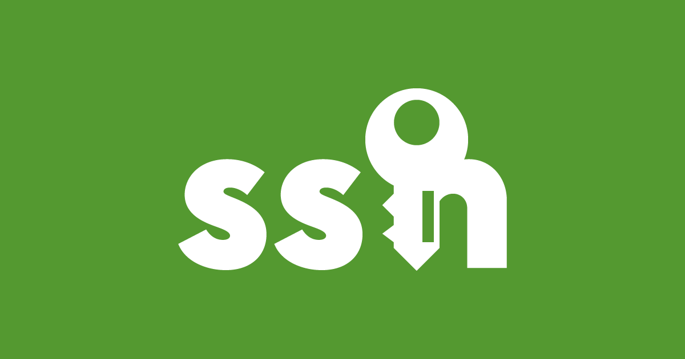
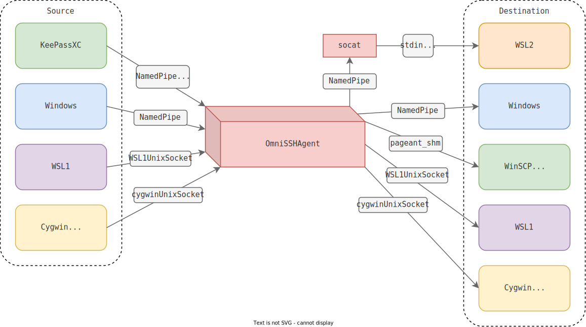
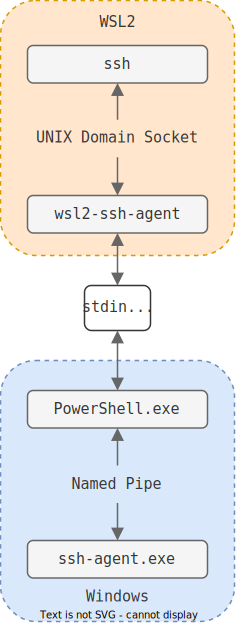
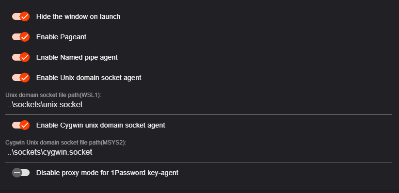
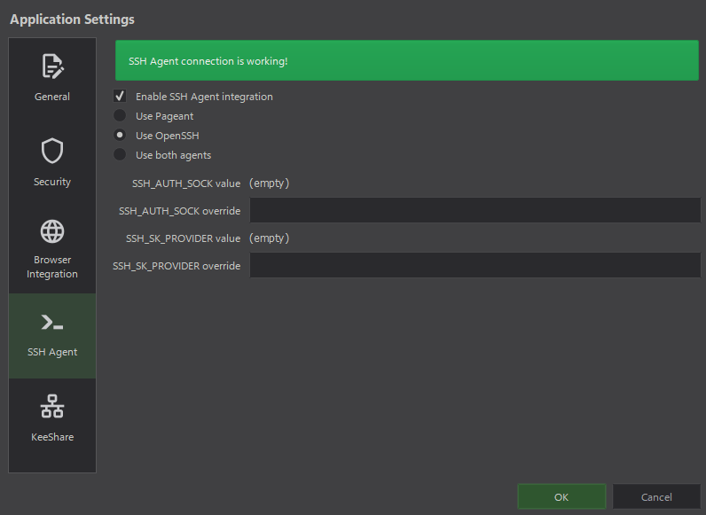
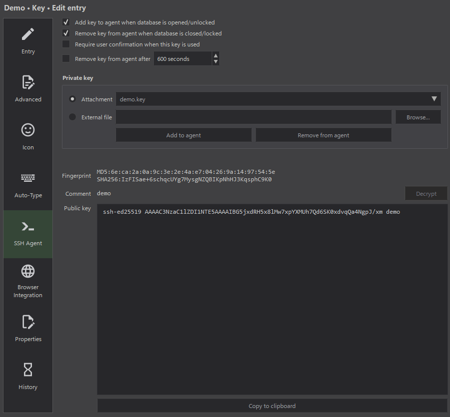

Greetings!

I finally decided to write something.
The first post and it's pretty whacky.
Sorry in advance for language mistakes.
After all, English isn't my first language.
Before the very essence, here's a little preamble:

I don't understand why some people don't care about their safety on the Internet.
They use one password for everything, or even though they use different passwords, they store them in <font class="hljs-attribute">passwords.txt</font> on a computer's desktop.
You shouldn't even ask them why they don't use a password manager, but if you do, you will get an answer something along the lines of '<font class="hljs-variable">gosh, who needs my passwords?</font>'.
Even when I told them to look for themselves in [data breaches](https://haveibeenpwned.com/), they remained unconvinced (but I'm sure that after this, in fear, they are quietly changing passwords, haha!).
Anyway, don't be that person and take care of yourself and your safety.
I was once like that, but as I grew up, I realized how vulnerable you are on the Internet, and after several data breaches and hacking attempts I began to use all kinds of safe solutions.
Don't trust any cloud-based password managers ([this is why](https://blog.lastpass.com/2022/12/notice-of-recent-security-incident/)), use a local password manager, use different passwords, use 2FA, and do backups!

So, here we go.

For a long time I used [KeePass](https://keepass.info/) with [KeeAgent](https://lechnology.com/software/keeagent/) plugin for forwarding SSH keys from the database to an SSH agent, and it was awesome.
What I liked about this combo:

- If the database is closed and you are trying to connect via SSH, [KeeAgent](https://lechnology.com/software/keeagent/) calls [KeePass](https://keepass.info/) to open a database for unlocking, and after unlocking the keys will be added to [KeeAgent](https://lechnology.com/software/keeagent/);

- [KeeAgent](https://lechnology.com/software/keeagent/) stores credentials in a non-persist way.

Recently I decided to move to [KeePassXC](https://keepassxc.org/) as it has better browser integration and a nicer interface. Since it relies on external agents ([Windows OpenSSH](https://github.com/PowerShell/Win32-OpenSSH) or [Pageant](https://www.chiark.greenend.org.uk/~sgtatham/putty/)), things I liked don't work here. I'm used to this, I'll try to replicate the functionality!

First I started looking for a suitable agent, as supported agents have issues:

- [Windows OpenSSH stores keys in Windows Registry](https://github.com/PowerShell/Win32-OpenSSH/issues/1487). For example, if you hard reset a computer keys will remain in the registry (sounds insecure, huh?). Using startup scripts for clearing the agent isn't the way. Also, there's [a fork of Windows OpenSSH](https://github.com/HiFiPhile/openssh-cleaned) that stores credentials in a non-persist way, but I wanna rely on the upstream version.

- Recent versions of [Pageant can integrate with Windows OpenSSH](https://the.earth.li/%7Esgtatham/putty/0.78/htmldoc/Chapter9.html#pageant-cmdline-openssh). Unfortunately, the named pipe path changes each reboot. The issue can be solved with bash/pwsh magic, but I'm trying to make as few dirty hacks as possible (it will sound more ironic when you continue reading that article).

I continued my search for the agent that suits my needs. I found [OmniSSHAgent](https://github.com/masahide/OmniSSHAgent), and it turned out that this is the best solution. It stores keys in a non-persist way and supports all communication interfaces:



Isn't this a dream?

To use the named pipe from Windows in [WSL2](https://learn.microsoft.com/en-us/windows/wsl/about) I could use [socat](http://www.dest-unreach.org/socat/) utility, but I decided to use [wsl2-ssh-agent](https://github.com/mame/wsl2-ssh-agent), which [makes a communication bridge between Windows and WSL2 with PowerShell](https://github.com/mame/wsl2-ssh-agent#how-wsl2-ssh-agent-works).



<!-- > 1. [Microsoft Edge WebView2](https://developer.microsoft.com/en-us/microsoft-edge/webview2/) is needed to work, but it's like it's available out of the box -->


Alright, I need to place these utilities somewhere.
I thought: what if I put configs and utilities in Windows' <font class="hljs-attribute">%USERPROFILE%/.ssh</font> and just link that path to [WSL2](https://learn.microsoft.com/en-us/windows/wsl/about)'s <font class="hljs-attribute">~/.ssh</font> to have the same config for both environments?
Without [additional WSL2 tuning](https://learn.microsoft.com/en-us/windows/wsl/wsl-config#automount-options), it will not work.
The problem is that Windows files inside [WSL2](https://learn.microsoft.com/en-us/windows/wsl/about) don't store Linux permissions by default, so most Windows files will have all [rwx](https://en.wikipedia.org/wiki/File-system_permissions#Numeric_notation) bits, and this will cause SSH clients to throw permission errors. To fix that, I edited <font class="hljs-attribute">/etc/wsl.conf</font>:

```ini
[automount]
options = "metadata"
```

Before linking directories, I moved <font class="hljs-attribute">%USERPROFILE%\\.ssh</font> to <font class="hljs-attribute">%USERPROFILE%\\.ssh.bak</font>, created <font class="hljs-attribute">%USERPROFILE%\\.ssh</font>, also moved <font class="hljs-attribute">\~/.ssh</font> to <font class="hljs-attribute">\~/.ssh.bak</font>. 
After that ran this command:

```bash
ln -sTv /mnt/c/Users/$(pwsh.exe -c '$env:USERNAME' | tr -d '\r')/.ssh $HOME/.ssh
```

Downloaded utilities were placed in <font class="hljs-attribute">\~/.ssh/bin</font>.
I added <font class="hljs-string">Include aliases/*</font> in <font class="hljs-attribute">\~/.ssh/config</font> to separate aliases between files.
It's very handy thing for me.
For example, <font class="hljs-attribute">~/.ssh/aliases/git</font> contains aliases for different repo-based platforms:

```yaml
Host github
  Hostname github.com
  User git

Host gitlab
  Hostname gitlab.com
  User git
```

Then I wrote [fix-perms.sh](./data/ssh/bin/fix-perms.sh) for fixing file permissions (mostly needed to run once after linking directories) and placed it in <font class="hljs-attribute">~/.ssh/bin</font>:

```sh
#!/usr/bin/env bash
cd $HOME/.ssh
chmod 600 authorized_keys config known_hosts* aliases/*
chmod 700 bin/*
```

At this moment I have the next file structure:

```plaintext
~/.ssh
├── aliases
│   └── git
├── bin
│   ├── omni-ssh-agent.exe
│   └── wsl2-ssh-agent
└── config
```

Appended the following command to <font class="hljs-attribute">~/.bashrc</font>:

```bash
eval $($HOME/.ssh/bin/wsl2-ssh-agent -socket /tmp/wsl.sock)
```

Enabled these options in [OmniSSHAgent](https://github.com/masahide/OmniSSHAgent)'s settings:



Made sure that [KeePassXC](https://keepassxc.org/) is correctly configured for integration with the agent:



And entries with a key are configured for adding to the agent:



Amazing, I got almost everything I need and configured all utilities.
At this moment, the named pipe will be accessible by any program that supports it from both environments.

So, how can I replicate the behavior of [KeeAgent](https://lechnology.com/software/keeagent/) when the database is locked?

At first, I decided to write a script that would replicate the behavior of [KeeAgent](https://lechnology.com/software/keeagent/).
Remember what I said about the irony? [This is it](./data/ssh/bin/wrapper.ps1):

```powershell
#!/usr/bin/env -S pwsh.exe -noni -nop -nol -ex bypass

$KpDatabase = "abs_windows_path_to_Database.kdbx"
$KpExecPath = "abs_windows_path_to_KeePassXC.exe"
$KpExecName = (Get-ChildItem $KpExecPath).Basename

$AgentExecPath = "$PSScriptRoot\omni-ssh-agent.exe"
$AgentExecName = (Get-ChildItem $AgentExecPath).Basename

Function Run-Agent {
  ssh-add -l 2>&1 | Out-Null # somehow it's faster than running it via Start-Process
  $ExitCode = $LastExitCode
  If ($ExitCode -eq 2) { # start the agent if it's not running
    $IsProcessRunning = Get-Process -ErrorAction SilentlyContinue $AgentExecName | Select -Expand ProcessName
    If (-Not $IsProcessRunning) {
      Start-Process -PassThru -WindowStyle Hidden $AgentExecPath 2>&1 | Out-Null
      Start-Sleep 1
    }
  }
  Return $ExitCode
}

Function Run-KeePass {
  $IsProcessRunning = (Get-Process -ErrorAction SilentlyContinue $KpExecName | Select -Expand ProcessName) ? $True : $False
  If (-Not $IsProcessRunning) {
    Start-Process -PassThru -WindowStyle Maximized $KpExecPath -ArgumentList $KpDatabase  2>&1 | Out-Null
    Start-Sleep 1
  }
  $IsWindowHidden = ((New-Object -ComObject WScript.Shell).AppActivate((Get-Process $KpExecName -ErrorAction SilentlyContinue).MainWindowTitle)) ? $False : $True
  If ($IsWindowHidden) {
    Start-Process $KpExecPath -PassThru 2>&1 | Out-Null
    Start-Sleep 1
  }
}

While ((Run-Agent) -ne 0) {
  Run-KeePass
  Start-Sleep -Seconds 3
}
```

I placed that script in <font class="hljs-attribute">~/.ssh/bin/wrapper.ps1</font>.
Logic explanation using pseudocode:

```python
while omnisshagent is empty:
  if omnisshagent is not running:
    startomnisshagent
  if keepassxc is not running:
    start keepassxc
  if keepassxc is minimized to tray:
    unminize keepassxc
```

Should be easy to understand.
Of course, I made sure that a million copies of programs will not spawn in that loop.

Now I must realize how to run that script before an SSH connection.
A wrapper for <font class="hljs-attribute">/usr/bin/ssh</font> in <font class="hljs-attribute">/usr/local/bin/ssh</font>?
Meh.
It will only work in [WSL2](https://learn.microsoft.com/en-us/windows/wsl/about) by running <font class="hljs-built_in">ssh</font>.
I need something to make the wrapper run anytime an SSH connection starts.
It makes sense to set this up somewhere in the SSH config.
[ProxyCommand](https://man7.org/linux/man-pages/man5/ssh_config.5.html)?
Ok, let's try:

```bash
Host *
  ProxyCommand "pwsh.exe -c c:/users/%u/.ssh/wrapper.ps1"
```

The command above was selected so that it runs equally well from both environments.

To use that option properly, [nc](https://man.openbsd.org/nc.1) must be called at the end of <font class="hljs-attribute">wrapper.ps1</font> with specific arguments to [create a TCP connection between the client and the server](https://blog.pcarleton.com/post/ssh-proxy/).
I rewrote the wrapper a little to be able to get arguments from the SSH config.
The config now:

```bash
Host *
  ProxyCommand "pwsh.exe -c c:/users/%u/.ssh/wrapper.ps1 %h %p"
```

Where <font class="hljs-variable">%h</font> is the hostname of the target alias, and <font class="hljs-variable">%p</font> is the port of the target alias.

Sadly, connections end up with a bad length error when I call Windows programs from <font class="hljs-attribute">wrapper.ps1</font>.
I haven't figured out what the problem is.
I think Windows programs create unwanted output that passes in stdin of the server then an error occurs.
I tried to call programs with output redirection, tried it via shell script, tried <font class="hljs-built_in">nc</font> for [Windows](https://nmap.org/ncat/) and [Linux](https://man.openbsd.org/nc.1), feels like I tried everything — no luck, skill issue for sure…

…then [Match](https://man.openbsd.org/ssh_config#Match) walks into the bar:

```bash
Match Host * exec "pwsh.exe -c c:/users/%u/.ssh/wrapper.ps1"
```

Yes, [RTFM](https://en.wikipedia.org/wiki/RTFM) moment.
Yes, it just runs the command before the connection.
Yes, no more dirty hacking in between.

The final file structure:

```plaintext
~/.ssh
├── aliases
│   └── git
├── bin
│   ├── fix-perms.sh
│   ├── omni-ssh-agent.exe
│   ├── wrapper.ps1
│   └── wsl2-ssh-agent
└── config
```

And [the SSH config](./data/ssh/config):

```bash
Include aliases/*
Match Host * exec "pwsh.exe -c c:/users/%u/.ssh/bin/wrapper.ps1"
```

Additionaly I added a handler to connect to aliases via <font class="hljs-string">ssh://</font> handler. It can be called from [KeePassXC](https://keepassxc.org/), Windows Run, a web browser, etc. [Source code of the handler](./data/ssh_handler.reg):

```re
Windows Registry Editor Version 5.00

[HKEY_CLASSES_ROOT\ssh]
@="URL:Windows OpenSSH Handler"
"URL Protocol"=""

[HKEY_CLASSES_ROOT\ssh\shell]
[HKEY_CLASSES_ROOT\ssh\shell\open]
[HKEY_CLASSES_ROOT\ssh\shell\open\command]
@="pwsh -wd ~ -c ssh %1"
```

The last line can be replaced with the following option to connect to the alias from [WSL2](https://learn.microsoft.com/en-us/windows/wsl/about) or by creating a separate handler with a different name:

```re
@="bash -c 'eval $($HOME/.ssh/wsl2-ssh-agent -socket /tmp/wsl2.sock) ssh %1'"
```

And finally I got what I wanted:

<video muted loop controls autoplay src="./assets/result.mp4"></video>
