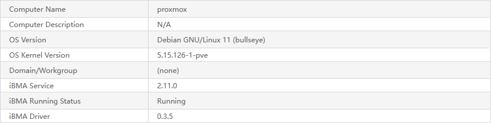

I had a little problem at work with a Huawei blade server.
I wanted to see the hardware information and manage things from [IPMI](https://en.wikipedia.org/wiki/Intelligent_Platform_Management_Interface) called [iBMC](https://e.huawei.com/en/products/computing/kunpeng/accessories/ibmc), but to do this I needed to install the agent called [iBMA](https://support.huawei.com/enterprise/en/doc/EDOC1100218100/426cffd9) on the host system, in my case [Proxmox](https://proxmox.com).

Well, I started digging for the information on the Huawei Enterprise website which is a real headache to interact.
I found that I needed to [compile the driver](https://support.huawei.com/enterprise/en/doc/EDOC1100218100/b5683fc2) and [install the service](https://support.huawei.com/enterprise/en/doc/EDOC1100218100/667adef0).
It seems okay, I found the information, it's probably worth downloading the software to start somehow now.
Tried to download the latest [software](https://support.huawei.com/enterprise/en/server/ibma-pid-21099187/software/) and... _\*sigh\*_


Support replied with a standard excuse that their system is being updated and maintained.
I got the same error when I tried to download something from there a year ago.
Infinite maintainance, unlucky me or sanctions?
Who knows.

I went looking for where I could download the packages.
By some luckily random query in Google I found [zaixia108's article](https://mysite.zaixia108.com/archives/1708076797558) about installing [iBMA](https://support.huawei.com/enterprise/en/doc/EDOC1100218100/426cffd9) with more easier instruction and, most importantly, download links.
All kudos to this man.

Judging by the article, some code lines about errors that could confuse the user are commented out in the package.
Also, there are no original packages and checksums, so I installed all this at my own risk.
I hope I won't be connected to a Chinese botnet.
I'm just living on the edge.

So, I did everything as in [zaixia108's article](https://mysite.zaixia108.com/archives/1708076797558) and it started up fine:



Just in case I bundled everything to a small archive without unnecessary packages for other distros and wrote a script for automatic installation.
If you wanna try it, you can download the bundle [here](/storage/logs/2_ibma_proxmox/).
Just unzip it somewhere in your Proxmox and run `setup.sh`, but beware: <font class="hljs-variable">this is all at your own risk</font>!

To be honest, my simple script doesn't seem like it should break anything…

```bash
#!/usr/bin/env bash

set -e

DEBIAN_FRONTEND=noninteractive

WORK_DIR="$(dirname "$(readlink -f "${0}")")"
DRIVER_DIR=$WORK_DIR/driver
SERVICE_DIR=$WORK_DIR/service

KERNEL_VER=$(uname -r)
DRIVER_VER=$(cat $DRIVER_DIR/build_manual.sh | grep -Po '(?<=DRV_VERSION=).*')
SERVICE_VER=$(cat $SERVICE_DIR/install.sh | grep -Po '(?<=IBMA_VERSION=).*')


echo -e '> Installing dependencies'
sudo apt-get update -q
sudo apt-get install -qy dkms pve-headers-$KERNEL_VER
cp -vf /usr/src/linux-headers-$KERNEL_VER/include/linux/stdarg.h $DRIVER_DIR/edma_drv 


echo -e "\n> Building the driver"
bash $DRIVER_DIR/build_manual.sh linux-headers-$KERNEL_VER
cp -vf $DRIVER_DIR/ibmadriver-$KERNEL_VER-$DRIVER_VER-linuxheaders.amd64.deb $SERVICE_DIR/drivers/Debian


echo -e "\n> Installing the service"
sudo systemctl stop iBMA.service 2> /dev/null || true
bash $SERVICE_DIR/install.sh -s

echo -e "\n> Done! Don't forget to reboot the server."
exit 0
```

…but here is a chance that Huawei software will do it.

And another just-in-case moment: I [mirrored packages](/storage/logs/2_ibma_proxmox/mirror/) from [zaixia108's article](https://mysite.zaixia108.com/archives/1708076797558).
